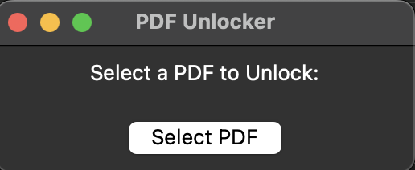
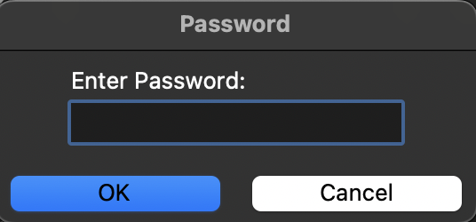

# PDF UNLOCKER

## PDF password remover with GUI

On executing pdf_unlocker.py it opens up GUI, on which you can select password protected PDF file and provide password, which unlocks and saves the PDF without the password in same location with _ in file name

## Installation

Run `pip instal -r requirements.txt`

execute `python pdf_unlocker.py`

## MAC OS Automator Setup

1. Open Automator:

    * Open Automator and create a new “Application.”

2. Add the "Run Shell Script" Action:
    * Drag the "Run Shell Script" action into the workflow area.

3. Configure the Shell Script:

    * In the "Run Shell Script" action, set the "Pass input" option to "as arguments."
    * Enter the shell script that calls your Python script with the passed PDF file as an argument:

    `/path/to/python3 /path/to/your_script.py "$@"`

4. Save the Automator application.

5. Select a PDF file, right-click, and choose "Open With" your Automator application.
    * Check the log file to ensure the correct file path is being passed.

6. This should ensure the selected PDF file is correctly passed to your Python script for unlocking.

